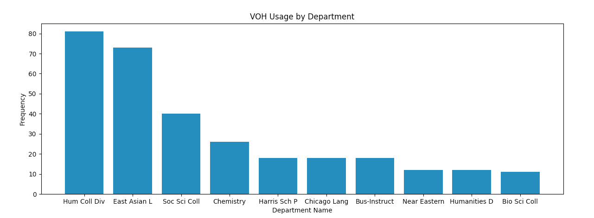
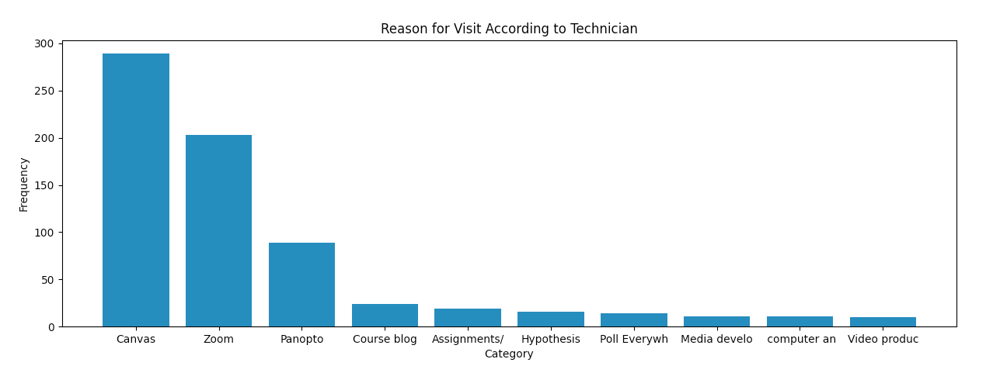

### Purpose
This is a tool for providing an overview of who our clients are, what their problems are, and how we solve them.

### Usage
1. Clone this repo
2. Create a virtual environment (optional)
3. Install requirements.txt (pip install -r requirements.txt)
4. Put the csv file in /input
5. From the command line run:

```bash
python main.py -input myCsvFile.csv
```

This will produce four text files in the /output folder.

If you would like to see graphs, add the "-plot" flag to the command.

### Information
This program currently provides three metrics:
1. VOH sessions per department (who our clients are)
2. Clients' reasons for coming to VOH (what their problems are)
3. Bigrams of our solution notes (how we solve them)

The plots summarize the most common data:





